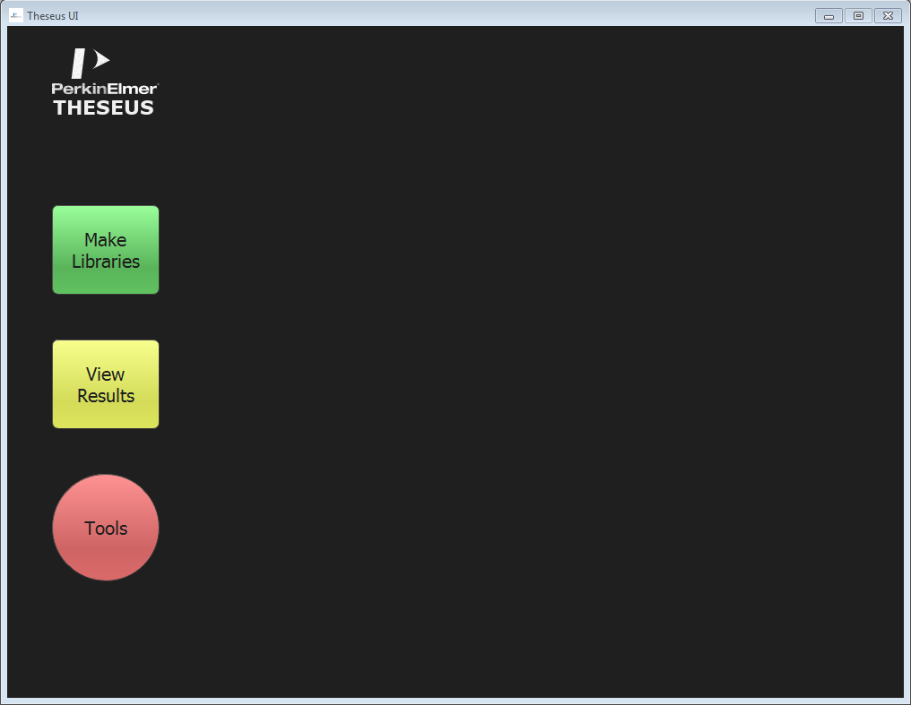
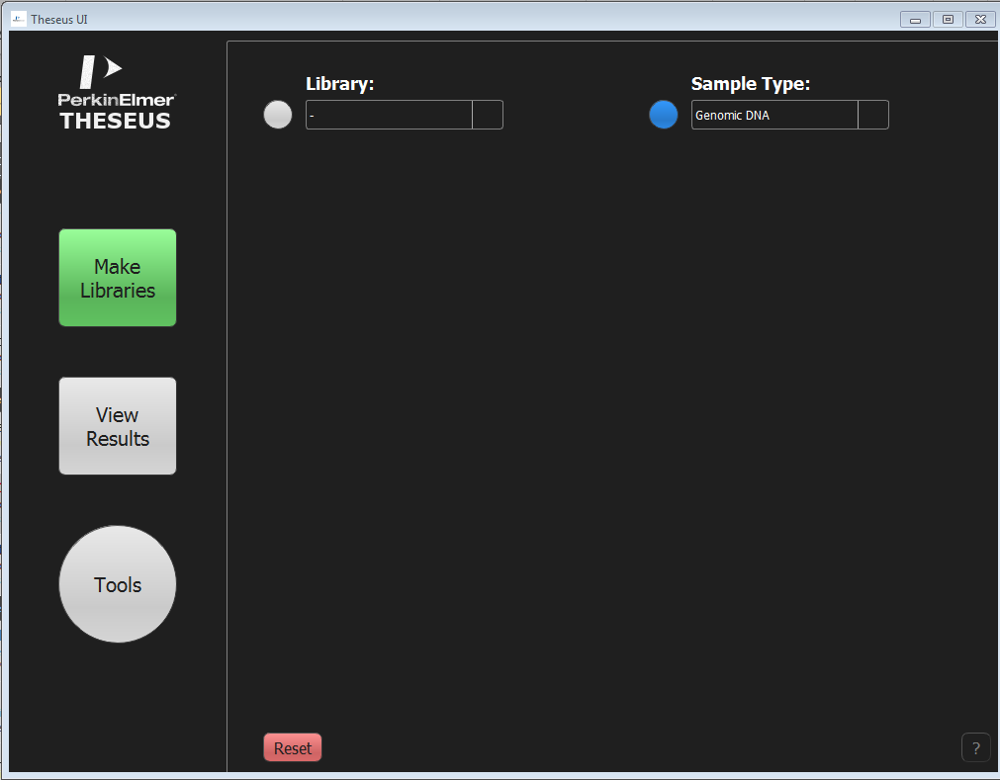
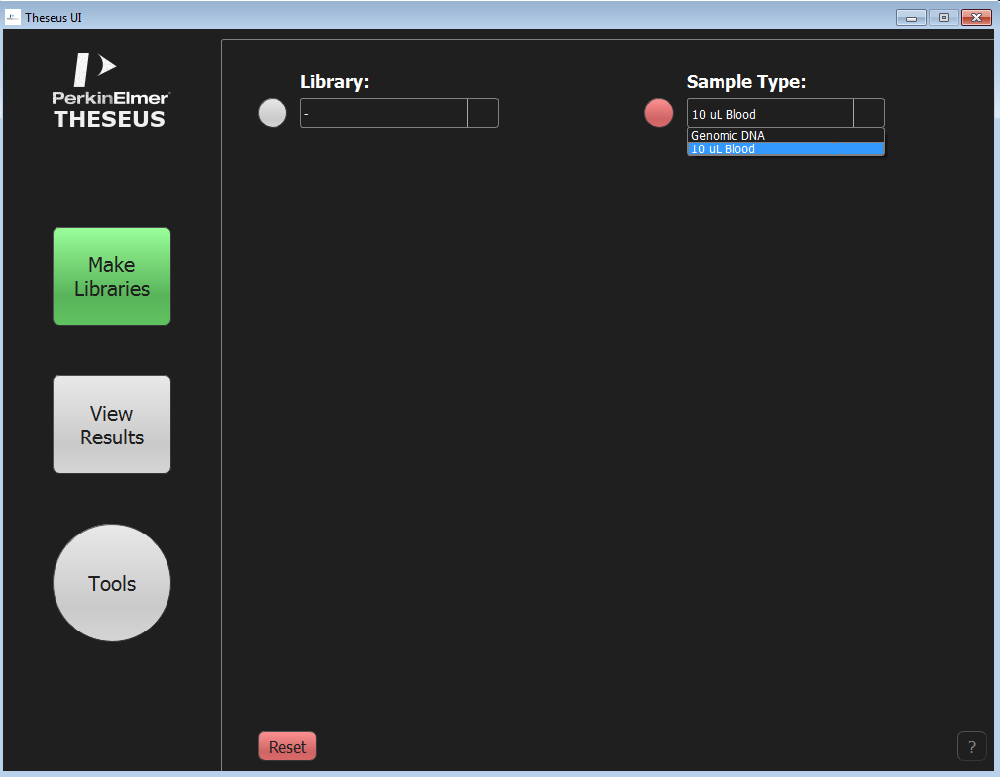
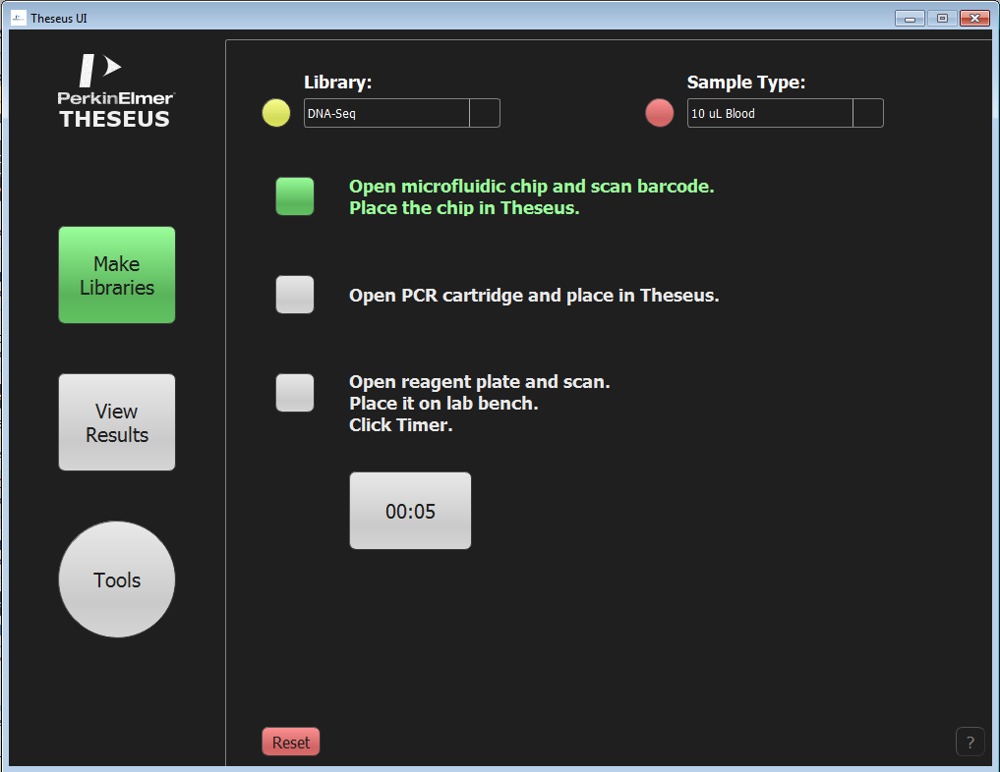
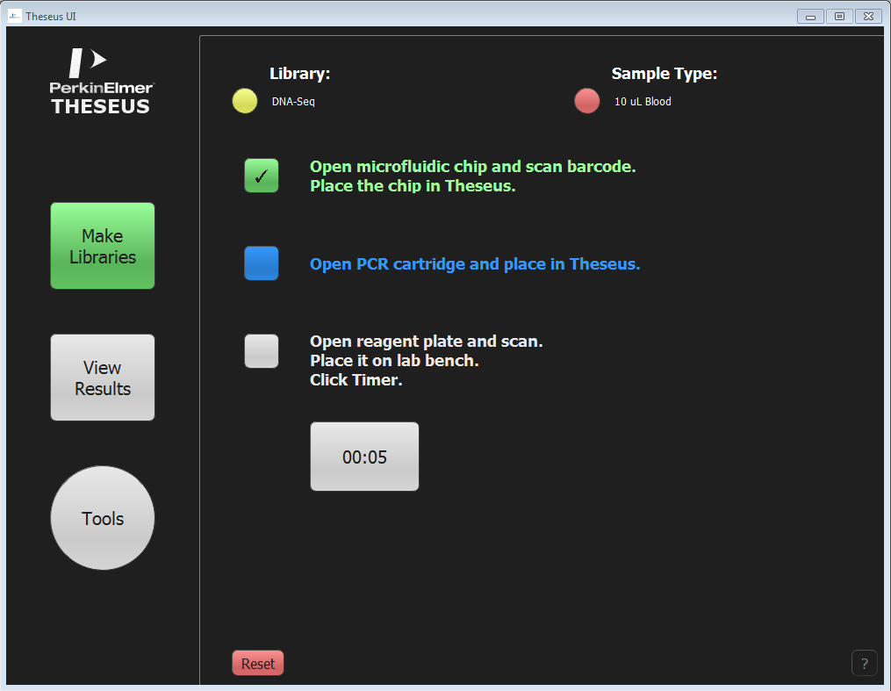
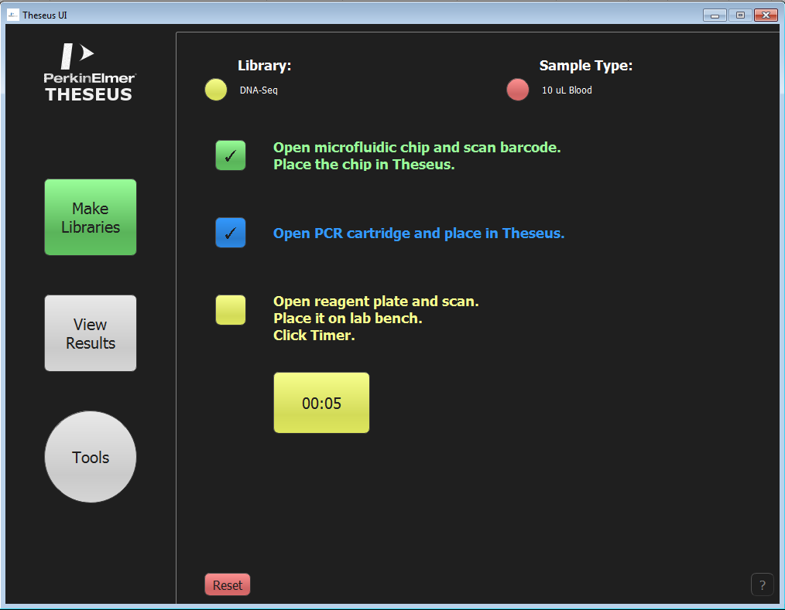
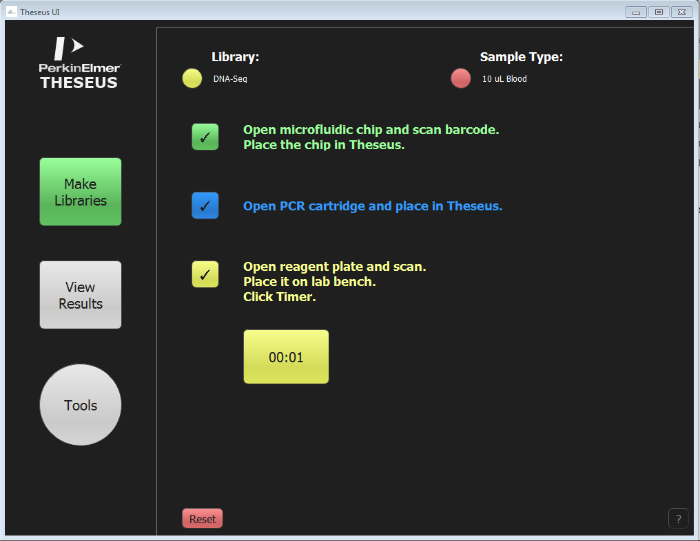
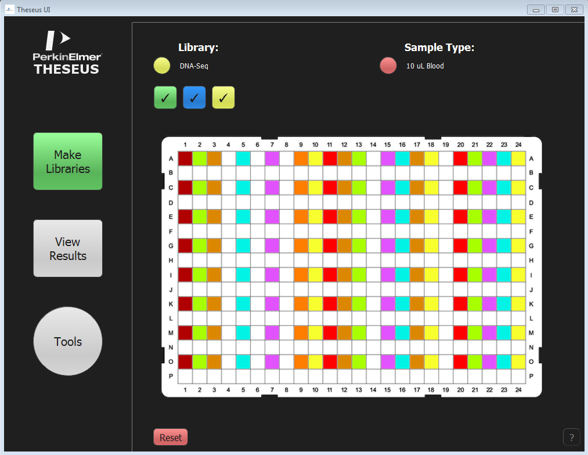

# theseus_ui

## Concept
These scripts and files make up the developmental Theseus UI. 


## Installation

Open a Unix terminal and type `git clone https://github.com/dfox3/theseus_ui.git`

Alternatively, you can download the zip from [the current repo](https://github.com/dfox3/theseus_ui) and unzip the directory.

## Requirements

These scripts are not packaged and are not standalone executable at this stage. 
Needed:
 - Windows cmd line
 - Python 3.7.X (latest version)
    - pip installed with
        - [PyQt5](https://pypi.org/project/PyQt5/)
        - For more information on how to pip install, visit [this guide](https://packaging.python.org/tutorials/installing-packages/#ensure-you-can-run-pip-from-the-command-line) for more information.


     - other imports from [The Python Standard Library](https://docs.python.org/2/library/) (typically pre-installed):
        - [functools](https://docs.python.org/3/library/functools.html)
        - [time](https://docs.python.org/3/library/time.html)

## Use:

Navigate to the working "theseus_ui" directory via Windows cmd.
Execute python script.

```
python theseus_ui.py
```

## Status

This is the opening screen of the software when launched. There are 3 buttons to choose from.


This screenshot shows the initial configuration of a Theseus run. User can choose from a dropdown a Library and Sample Type for the run. Dropdowns were used so newly developed App scripts can be more easily (automatically) incorporated into the UI. The user will also have a Reset button and a ? button that will abort and guide the user respectively via prompts.


Here is an example of one of the dropdowns.


After the Library and Sample Type is configured, the user can then ready the intrument with a 3 step process. These steps are currentlt clickable for testing purposes - the ideal system waits for system barcode triggers to check the buttons.




Click the timer and wait. Timer set for 5 secs for testing.




Plate displays preloaded wells w/ reagents colorized. This is currently a static image, but ideally these will be generated on a Library to Library basis.



### Not yet developed:
 - Reset prompt
 - ? button help prompt
 - dynamic plate diagram with clickable input wells
 - sample info form
 - run screen and run timer
 - view results screen
 - tools screen


## Info:

**20190812**

**Dylan Fox**

**dylan.fox@perkinelmer.com**
